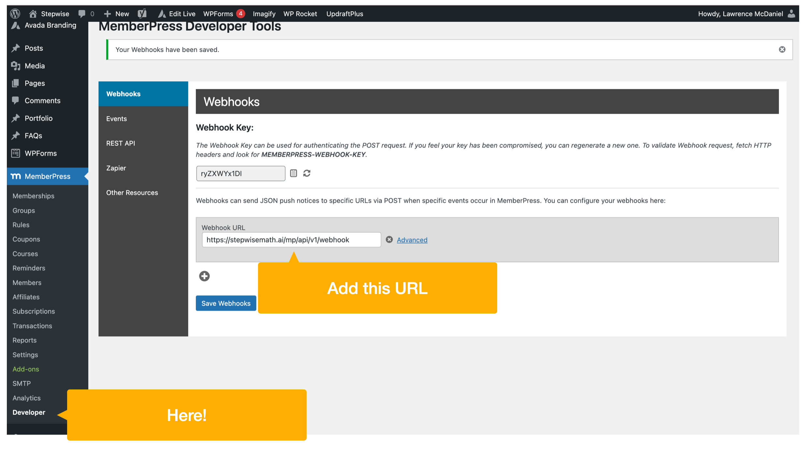

# Django Plugin For memberpress REST API Client

[](https://pypi.org/project/django-memberpress-client/) [](https://memberpress.com/addons/developer-tools/) [](https://lawrencemcdaniel.com)


A lightweight, performant Django plugin that implements REST api and Webhook integrations for the [Wordpress](https://wordpress.org/) [memberpress](https://memberpress.com/blog/memberpress-developer-tools/) Pro plugin.

## Installation

```bash
pip install django-memberpress-client
```

Set the Django settings using tutor.

```python
from django.conf import settings

settings.MEMBERPRESS_API_KEY = 'set-me-please'
settings.MEMBERPRESS_API_BASE_URL = 'https://set-me-please.com/'
```

You'll find the memberpress API Key in the Wordpress admin site.


## Usage

### REST API

```python
from memberpress_client.member import Member

# 1. passing an explicit Wordpress username
member = Member(username="jsmith")
print(member.is_active_subscription)
print(member.is_trial_subscription)
print(member.should_raise_paywall)
print(member.latest_transaction.amount)
print(member.recent_subscriptions[0].created_at)
print(member.active_memberships[0].pricing_title)

# 2. using with Django request object
member = Member(request=request)

# 3. passing a Django user object
member = Member(user=user)

# 4. passing a Django user object
member = Member(user=user)

# 5. passing an json return object from memberpress REST API
member = Member(response=memberpress_response_json)
```

### Webhooks

You can setup this plugin to receive events via memberpress' webhooks framework, a Pro 'developer tools' premium option of memberpress. Add a url of the form https://yourdomain.com/mp/api/v1/webhook to the Developer "Webhooks" page.


urls:

- https://yourdomain.com/mp/api/v1/events/
- https://yourdomain.com/mp/api/v1/events/log/


## Developers

Use these class objects rather than working directly with the memberpress
json dicts returned by the api. These class objects include structural and type-checking validations,
plus they strongly type all of the dict key values for you.

### class hierarchy

```python
class Memberpress:

    class MemberpressEvent(Memberpress):

    class MemberpressAPIClient(Memberpress):
        class Member(MemberpressAPIClient):
        class Membership(MemberpressAPIClient):
        class Subscriber(MemberpressAPIClient):
        class Transaction(MemberpressAPIClient):
```

### constants

Use these built-in constants rather than working directly the dict key string values:

- MemberpressEvents: discrete list of memberpress event types. The str value exactly matches the event dict key "event".
- MemberpressEventTypes: discrete list of memberpress event_types

```python
from memberpress_client.constants import MemberpressEvents

print(MemberpressEvents.AFTER_CC_EXPIRES_REMINDER)
after-cc-expires-reminder

print(MemberpressEvents.AFTER_MEMBER_SIGNUP_REMINDER)
after-member-signup-reminder

print(MemberpressEvents.LOGIN)
login

print(MemberpressEvents.MEMBER_ACCOUNT_UPDATED)
member-account-updated

print(MemberpressEvents.SUBSCRIPTION_EXPIRED)
subscription-expired
# ...
# ectetera, etcetera, etcetera ...
# ...
print(MemberpressEvents.TRANSACTION_COMPLETED)
transaction-completed
```

### developer getting started guide

Keep in mind that this code package is intended to install as an add-on to your existing Django project. Therefore,
the 'production' settings and requirements intentionally ommit all Django and Django support packages
other than those that are unique to this repo. The 'local' settings and requirements compensate for this by including all of the settings and requirements that you'd typically find in 'common' and/or 'production'.

You should be able to follow the normal workflow for setting up a Django project for local development. This substantially
consists of the following:

- install all service-level dependencies on your local dev machine. This includes MySQL and Redis.
- clone this repo
- pre-commit install
- create a mysql database. see 'make db'
- ./manage.py migrate. see 'make migrate'
- ./manage.py runserver. see 'make server'
- ./manage.py createsuperuser. see 'make server'

Note that the Makefile is specific to macOS environments (my sincerest apologies), and it assumes that you've installed mysql and redis using homebrew.
